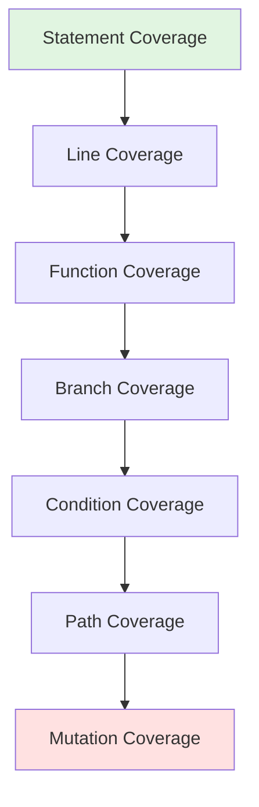

# Test Coverage Best Practices

## Purpose

This document provides guidelines for measuring, analyzing, and improving test coverage across different levels of the testing pyramid. Effective coverage analysis ensures testing efforts are focused on the most critical areas while maintaining overall software quality.

## Coverage Metrics

### Types of Coverage

| Coverage Type | Definition | What It Measures | Tools |
|---------------|------------|------------------|-------|
| **Line Coverage** | Percentage of executable lines executed | Basic code execution | Istanbul, Jest,Coverage.py |
| **Branch Coverage** | Percentage of branch outcomes executed | True/false paths in conditionals | Istanbul, Jest, Coverage.py |
| **Function/Method Coverage** | Percentage of functions called | Function invocation | Istanbul, Jest, Coverage.py |
| **Statement Coverage** | Percentage of statements executed | Similar to line coverage | Most coverage tools |
| **Condition Coverage** | Boolean sub-expression outcomes | Complex condition logic | Advanced tools, manual analysis |
| **Path Coverage** | Possible execution paths through code | Flow complexity | Manual analysis, advanced tools |
| **Mutation Coverage** | Survivability of code mutations | Test quality/effectiveness | Stryker, Pitest |

### Coverage Metric Relationships



- **Statement/Line**: Baseline metric, easiest to achieve
- **Branch**: More meaningful, captures conditional paths
- **Condition**: Captures complex boolean logic
- **Path**: Most comprehensive but often impractical
- **Mutation**: Measures test effectiveness, not just execution

## Coverage Targets by Pyramid Level

### Test Pyramid Coverage Distribution

```yaml
Unit Tests (Foundation):
  Target Coverage: 80-90%
  Focus:
    - Business logic
    - Data transformations
    - Utility functions
    - Edge cases
  Metrics:
    - Branch coverage emphasized
    - Critical paths: 90%+
    - Utility code: 80%+

Integration Tests:
  Target Coverage: 60-70%
  Focus:
    - API endpoints
    - Database interactions
    - Service communication
    - Data flow validation
  Metrics:
    - Happy paths + error paths
    - Contract coverage
    - Integration point coverage

End-to-End Tests:
  Target Coverage: 20-40%
  Focus:
    - Critical user journeys
    - Cross-system workflows
    - Key business transactions
  Metrics:
    - Feature coverage (not code)
    - User journey completion
    - Integration of key components
```

### Coverage Targets by Risk Level

```yaml
Critical (Security, Payments, Auth):
  Unit: 90%+ branch coverage
  Integration: All endpoints/flows
  E2E: All critical user journeys

High (Core Business Logic):
  Unit: 80%+ branch coverage
  Integration: Key workflows
  E2E: Primary user paths

Medium (Supporting Features):
  Unit: 70%+ branch coverage
  Integration: Main use cases
  E2E: Representative flows

Low (UI, Display, Simple CRUD):
  Unit: 60%+ line coverage
  Integration: Basic validation
  E2E: Smoke tests only
```

## Gap Analysis Techniques

### 1. Coverage-Based Gap Analysis

```typescript
// Example: Identifying coverage gaps
/**
 * Coverage Report Analysis:
 *
 * File: src/services/payment.service.ts
 * Line Coverage: 65% (Target: 80%)
 * Branch Coverage: 45% (Target: 70%)
 *
 * Gaps Identified:
 * - Lines 45-55: Error handling for declined cards
 * - Lines 78-85: Refund processing logic
 * - Branch at line 23: Alternative payment methods
 *
 * Action Items:
 * - [ ] Add tests for declined card scenarios
 * - [ ] Add tests for refund workflow
 * - [ ] Add tests for alternative payment methods
 * - [ ] Add edge case tests for amount validation
 */
```

### 2. Feature-to-Test Mapping

```yaml
Feature: User Authentication
  Requirements:
    - User can register with email
    - User can login with valid credentials
    - User cannot login with invalid credentials
    - User can reset password
    - User session expires after inactivity

  Test Coverage Matrix:
    Register Email:
      - Unit: ✅ Validation logic
      - Integration: ✅ API endpoint
      - E2E: ✅ Full flow
    Login Valid:
      - Unit: ✅ Authentication service
      - Integration: ✅ Auth endpoint
      - E2E: ✅ Login journey
    Login Invalid:
      - Unit: ⚠️ Missing error handling tests
      - Integration: ✅ Error responses
      - E2E: ✅ Error display
    Reset Password:
      - Unit: ⚠️ No coverage
      - Integration: ⚠️ No coverage
      - E2E: ⚠️ No coverage
    Session Expiry:
      - Unit: ⚠️ No coverage
      - Integration: ✅ Token validation
      - E2E: ⚠️ No coverage

  Gaps: Password reset flow, session expiry E2E
```

### 3. Risk-Based Gap Analysis

```typescript
/**
 * Risk Assessment Coverage Matrix
 *
 * Component | Risk Level | Coverage | Gap | Priority
 * ----------|------------|----------|-----|----------
 * Payment   | Critical  | 75%      | 25% | P0
 * Auth      | Critical  | 90%      | 10% | P1
 * User Data | High      | 80%      | 20% | P1
 * Search    | Medium    | 60%      | 40% | P2
 * UI Utils  | Low       | 50%      | 50% | P3
 *
 * Priority Definitions:
 * - P0: Critical gap, must address this sprint
 * - P1: High priority, address within 2 sprints
 * - P2: Medium priority, address in next quarter
 * - P3: Low priority, backlog for consideration
 */
```

### 4. Change-Based Gap Analysis

```yaml
For Each PR/Commit:
  1. Identify changed files
  2. Check existing coverage for changed lines
  3. Require test coverage for new code:
     - Critical changes: 90%+ branch coverage
     - High changes: 80%+ branch coverage
     - Medium changes: 70%+ line coverage
     - Low changes: 60%+ line coverage
  4. Update coverage baseline
```

## Balancing Coverage with Quality

### Coverage Anti-Patterns

```yaml
Anti-Pattern 1: High Percentage, Low Value
  Example: 95% coverage with meaningless assertions
  Problem: Coverage metric achieved, quality not improved
  Solution: Focus on meaningful assertions and edge cases

Anti-Pattern 2: Testing Implementation
  Example: Testing private methods, implementation details
  Problem: Brittle tests, refactoring becomes difficult
  Solution: Test public interfaces and observable behavior

Anti-Pattern 3: Coverage Without Context
  Example: Chasing 100% coverage on low-risk code
  Problem: Misplaced effort, diminishing returns
  Solution: Risk-based coverage targets

Anti-Pattern 4: Coverage Inflation
  Example: Tests that exercise code without assertions
  Problem: False sense of security
  Solution: Require meaningful assertions in coverage reports
```

### Quality Over Quantity Examples

```typescript
// BAD: High coverage, low value
test('calculator', () => {
  calc.add(1, 2); // Covered but no assertion
  calc.subtract(5, 3); // Covered but no assertion
  calc.multiply(2, 3); // Covered but no assertion
});

// GOOD: Meaningful coverage
describe('Calculator', () => {
  test('adds two numbers correctly', () => {
    expect(calc.add(1, 2)).toBe(3);
    expect(calc.add(-1, 1)).toBe(0);
    expect(calc.add(0, 0)).toBe(0);
  });

  test('handles edge cases', () => {
    expect(calc.add(Number.MAX_SAFE_INTEGER, 1)).not.toBe(Number.MAX_SAFE_INTEGER);
    expect(calc.add(-1, Number.MIN_SAFE_INTEGER)).toBeDefined();
  });
});
```

### Coverage Quality Checklist

For each coverage percentage achieved:

- [ ] Tests cover both success and failure paths
- [ ] Edge cases are tested (null, undefined, empty, limits)
- [ ] Error handling is verified
- [ ] Tests have meaningful assertions
- [ ] Tests are maintainable and clear
- [ ] Tests validate behavior, not implementation
- [ ] Critical paths have higher coverage

## Tools and Implementation

### JavaScript/TypeScript

```yaml
Jest:
  - Built-in coverage with Istanbul
  - Configuration: jest.config.js
  - Thresholds: coverageThreshold

Istanbul/NYC:
  - Standalone coverage tool
  - Multiple reporters (HTML, JSON, LCov)
  - Line and branch coverage

Playwright Coverage:
  - Collects coverage during E2E tests
  - Integrates with Istanbul
  - Shows E2E coverage contribution
```

### Configuration Example

```javascript
// jest.config.js
module.exports = {
  collectCoverageFrom: [
    'src/**/*.{js,jsx,ts,tsx}',
    '!src/**/*.d.ts',
    '!src/**/*.stories.{js,jsx,ts,tsx}',
    '!src/**/__tests__/**',
  ],
  coverageThreshold: {
    global: {
      branches: 70,
      functions: 75,
      lines: 75,
      statements: 75,
    },
    // Critical paths have higher thresholds
    './src/services/auth/': {
      branches: 90,
      functions: 90,
      lines: 90,
      statements: 90,
    },
    './src/utils/': {
      branches: 80,
      functions: 80,
      lines: 80,
      statements: 80,
    },
  },
  coverageReporters: ['json', 'lcov', 'text', 'html'],
};
```

### Python

```yaml
pytest-cov:
  - Coverage plugin for pytest
  - Generates HTML and terminal reports
  - Branch coverage support

Coverage.py:
  - Standalone coverage tool
  - Supports multiple reporters
  - Configuration via .coveragerc
```

### Configuration Example (.coveragerc)

```ini
[report]
# Coverage thresholds
fail_under = 75
precision = 2

# Exclude patterns
omit =
    */tests/*
    */venv/*
    */__pycache__/*
    setup.py

[html]
directory = htmlcov
```

## Coverage Reports and Visualization

### Regular Reporting

```yaml
Daily:
  - PR coverage diffs (new code vs threshold)
  - Failed coverage threshold alerts

Weekly:
  - Coverage trend reports
  - Coverage gap analysis
  - Risk-based coverage assessment

Monthly:
  - Comprehensive coverage dashboard
  - Coverage quality assessment
  - Coverage goal progress
```

### Report Components

```markdown
# Test Coverage Report - Week of 2024-01-15

## Summary
| Metric | Current | Target | Change |
|--------|---------|--------|--------|
| Line Coverage | 78% | 75% | +2% |
| Branch Coverage | 65% | 70% | -1% |
| Function Coverage | 82% | 75% | +1% |

## Critical Gaps
1. **Payment Service** (src/services/payment.ts)
   - Current: 65% | Target: 90%
   - Missing: Refund logic, decline handling
   - Risk: High | Priority: P0

2. **Auth Middleware** (src/middleware/auth.ts)
   - Current: 70% | Target: 90%
   - Missing: Token refresh, expiry handling
   - Risk: Critical | Priority: P0

## Recent Improvements
- User service coverage: 60% → 85%
- Search algorithm coverage: 50% → 75%

## Action Items
- [ ] Add payment refund tests (Assigned: @qa-team)
- [ ] Add auth token tests (Assigned: @dev-team)
```

## Coverage Goals and Tracking

### SMART Coverage Goals

```yaml
Specific:
  - Increase branch coverage in payment service from 65% to 85%
  - Add tests for all critical auth flows

Measurable:
  - Track coverage percentage per module
  - Count new tests added per sprint

Achievable:
  - Incremental improvements over sprints
  - Focus on high-value areas first

Relevant:
  - Align coverage with business risk
  - Prioritize customer-facing features

Time-Bound:
  - Achieve 75% branch coverage by Q2
  - Cover all critical paths by end of Q1
```

### Tracking Template

```typescript
/**
 * Coverage Tracking
 *
 * Sprint: 24.03
 * Start Date: 2024-01-15
 * End Date: 2024-01-29
 *
 * Goals:
 * - [ ] Increase overall coverage from 72% to 75%
 * - [ ] Achieve 85% coverage on payment service
 * - [ ] Add E2E coverage for top 5 user journeys
 *
 * Progress:
 * - Payment service: 65% → 78% ✅
 * - Overall coverage: 72% → 74% (in progress)
 * - E2E journeys: 3/5 completed ⚠️
 *
 * Blockers:
 * - API mocking for payment gateway
 * - Test data for edge cases
 *
 * Next Steps:
 * - Mock payment gateway responses
 * - Generate edge case test data
 * - Complete remaining 2 E2E journeys
 */
```

## Integrating Coverage into CI/CD

### Quality Gates

```yaml
Pre-Merge:
  - New code must meet coverage threshold
  - Overall coverage cannot decrease
  - Critical files require higher coverage

Pre-Deploy:
  - Minimum coverage threshold met
  - No significant coverage drops
  - Critical paths have required coverage

Monitoring:
  - Coverage trend alerts
  - Coverage drop notifications
  - Risk-based coverage reports
```

### Example CI Configuration

```yaml
# .github/workflows/coverage.yml
name: Coverage Check

on: [pull_request]

jobs:
  coverage:
    runs-on: ubuntu-latest

    steps:
      - uses: actions/checkout@v3

      - name: Run tests with coverage
        run: npm test -- --coverage

      - name: Check coverage thresholds
        run: |
          COVERAGE=$(cat coverage/coverage-summary.json | jq '.total.lines.pct')
          if (( $(echo "$COVERAGE < 75" | bc -l) )); then
            echo "Coverage $COVERAGE% is below 75% threshold"
            exit 1
          fi

      - name: Upload coverage report
        uses: actions/upload-artifact@v3
        with:
          name: coverage-report
          path: coverage/

      - name: Comment PR with coverage
        uses: romeovs/lcov-reporter-action@v0.3.1
        with:
          lcov-file: ./coverage/lcov.info
          github-token: ${{ secrets.GITHUB_TOKEN }}
```
