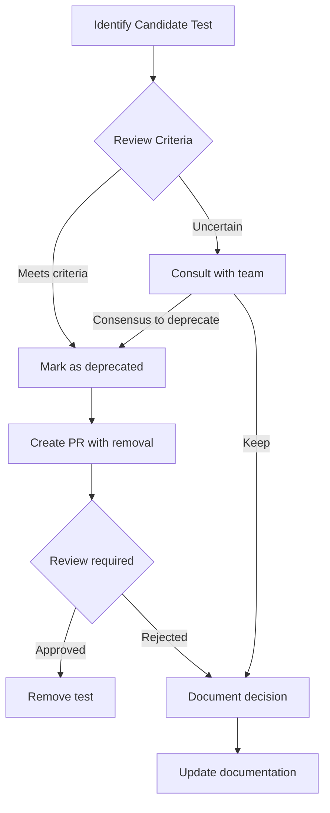

# Test Maintenance Best Practices

## Purpose

This document outlines strategies and practices for keeping test suites healthy, maintainable, and valuable. Well-maintained tests provide fast, reliable feedback and reduce the cost of change over time.

## Regular Maintenance Tasks

### Daily/Per-Commit Tasks

| Task | Frequency | Owner | Description |
|------|-----------|-------|-------------|
| **Fix broken tests** | Per commit | Committer | Don't commit with failing tests |
| **Update documentation** | As needed | Committer | Keep docs in sync with test changes |
| **Review flaky results** | Per run | QA Team | Identify intermittent failures |

### Weekly Tasks

| Task | Frequency | Owner | Description |
|------|-----------|-------|-------------|
| **Test health review** | Weekly | QA Lead | Review pass/fail trends, identify problems |
| **Selector audit** | Weekly | QA Team | Check for brittle selectors after UI changes |
| **Dependency updates** | Weekly | QA Team | Update test framework and dependencies |

### Monthly Tasks

| Task | Frequency | Owner | Description |
|------|-----------|-------|-------------|
| **Code coverage analysis** | Monthly | QA Team | Identify untested code, remove dead tests |
| **Duplication cleanup** | Monthly | QA Team | Refactor repeated code into reusable functions |
| **Test suite audit** | Monthly | QA Lead | Remove obsolete tests, reorganize structure |
| **Performance review** | Monthly | QA Team | Identify slow tests, optimize execution time |
| **Selector stability check** | Monthly | QA Team | Replace dynamic selectors with stable ones |

## Test Deprecation Strategy

### Deprecation Criteria

Deprecate (remove or disable) tests when:

```yaml
Obsolete Features:
  - Feature has been removed from product
  - Feature is being sunset
  - Test coverage has moved to a different level

Unmaintainable Tests:
  - Test consistently fails (>80%) and fixing cost exceeds value
  - Test depends on deprecated functionality
  - Test code is unreadable and rewriting is cheaper than fixing

Redundant Tests:
  - Same scenario tested multiple times at same level
  - Higher-level test makes lower-level test redundant
  - Edge case covered by broader test suite

Performance Issues:
  - Test consistently exceeds timeout threshold
  - Optimization attempts have failed
  - Value of test doesn't justify execution time
```

### Deprecation Process



### Deprecation Workflow

1. **Identify**: Tag test with `@deprecated` in code
2. **Document**: Add comment explaining reason and date
3. **Notify**: Inform team in standup or via PR
4. **Remove**: Create PR to remove deprecated tests
5. **Verify**: Ensure test suite still passes without deprecated tests

### Example: Marking Deprecated Tests

```typescript
/**
 * @deprecated
 * Reason: Feature 'legacy_checkout' was removed in v2.0
 * Deprecated: 2024-01-15
 * Removal Target: 2024-02-01
 * Contact: qa-team@example.com
 */
test('legacy checkout flow', async () => {
  // This test will be removed in next sprint
});
```

## Performance Optimization

### Identifying Performance Issues

```yaml
Slow Test Indicators:
  - Execution time > 30 seconds for UI test
  - Execution time > 5 seconds for API test
  - Execution time > 1 second for unit test
  - Total suite time increases by >10% month-over-month

Optimization Targets:
  - Unnecessary waits (hardcoded sleeps)
  - Redundant setup/teardown
  - Inefficient selector queries
  - Lack of parallelization
  - Heavy test data generation
```

### Optimization Techniques

#### 1. Remove Hardcoded Waits

```typescript
// BAD - Arbitrary wait
await page.waitForTimeout(5000);

// GOOD - Wait for specific condition
await page.waitForSelector('[data-testid="success-message"]');
await page.waitForResponse(resp => resp.url().includes('api/submit'));
```

#### 2. Optimize Test Data

```typescript
// BAD - Generate fresh data for every test
beforeEach(async () => {
  testUser = await createComplexUserWithProfile();
});

// GOOD - Reuse or reset data
beforeAll(async () => {
  testUser = await getOrCreateTestUser();
});

afterEach(async () => {
  await resetUserData(testUser.id);
});
```

#### 3. Parallelize Independent Tests

```typescript
// Configure parallel execution in test framework
// Playwright example
module.exports = {
  workers: process.env.CI ? 2 : 4,
  fullyParallel: true,
};
```

#### 4. Share Setup When Appropriate

```typescript
// BAD - Same login in every test
test('view dashboard', async () => {
  await login(page, credentials);
  await page.goto('/dashboard');
});

test('edit profile', async () => {
  await login(page, credentials); // Duplicate!
  await page.goto('/profile');
});

// GOOD - Use shared auth or test fixtures
test.describe('authenticated user', () => {
  beforeEach(async () => {
    await login(page, credentials);
  });

  test('view dashboard', async () => {
    await page.goto('/dashboard');
  });

  test('edit profile', async () => {
    await page.goto('/profile');
  });
});
```

## Documentation Upkeep

### Documentation Requirements

Every test file should include:

```typescript
/**
 * Test Suite: [Feature Name]
 *
 * Purpose: [What this suite validates]
 * Coverage: [What scenarios are covered]
 * Dependencies: [External systems, data requirements]
 * Maintenance Notes: [Known issues, special considerations]
 *
 * @last-updated 2024-01-15
 * @maintainer qa-team@example.com
 */
```

### Documentation Update Checklist

- [ ] Test descriptions match current behavior
- [ ] Comments explain complex logic
- [ ] Edge cases are documented
- [ ] Known issues are noted with `@todo` tags
- [ ] Test data requirements are clear
- [ ] Environment-specific notes are included

## Anti-Patterns to Avoid

### 1. Brittle Selectors

```typescript
// Anti-Pattern: Selector tied to implementation
await page.click('.btn-primary.btn-large'); // CSS classes can change

// Better: Semantic selector
await page.click('[data-testid="submit-button"]');
```

### 2. Over-Specified Tests

```typescript
// Anti-Pattern: Testing implementation details
test('search works', async () => {
  await page.fill('input[name="q"]', 'test');
  await page.press('input[name="q"]', 'Enter');
  await page.waitForURL('**/search?q=test');
  await expect(page.locator('.results')).toHaveCount(10);
  // Too many details, too fragile
});

// Better: Test outcome, not implementation
test('search shows relevant results', async () => {
  await searchPage.search('test');
  await expect(searchPage.results).toBeVisible();
  await expect(searchPage.firstResult).toContainText('test');
});
```

### 3. Missing Cleanup

```typescript
// Anti-Pattern: State leakage between tests
test('creates user', async () => {
  await createUser({ name: 'Test User' });
  // No cleanup - subsequent tests might fail
});

// Better: Clean up after test
test('creates user', async () => {
  const user = await createUser({ name: 'Test User' });
  await cleanupUser(user.id);
});
```

### 4. Test Duplication

```typescript
// Anti-Pattern: Same test repeated
test('login with valid credentials', async () => {
  await page.goto('/login');
  await page.fill('#username', 'test@example.com');
  await page.fill('#password', 'password');
  await page.click('#login');
  await expect(page).toHaveURL('/dashboard');
});

test('user can sign in', async () => { // Same test!
  await page.goto('/login');
  await page.fill('#username', 'test@example.com');
  await page.fill('#password', 'password');
  await page.click('#login');
  await expect(page).toHaveURL('/dashboard');
});

// Better: One test, or data-driven if variations exist
test('login with valid credentials', async () => {
  await loginPage.login('test@example.com', 'password');
  await expect(page).toHaveURL('/dashboard');
});
```

## Refactoring Guidelines

### When to Refactor

```yaml
Code Duplication:
  - Same code in 3+ places → Extract to function
  - Similar patterns in tests → Create test helpers
  - Repeated setup → Use fixtures or hooks

Complexity:
  - Test >100 lines → Consider breaking into multiple tests
  - Nested assertions >3 levels → Flatten or extract
  - Multiple responsibilities → Separate concerns

Readability:
  - Unclear test purpose → Add documentation
  - Magic numbers/values → Use named constants
  - Confusing variable names → Rename for clarity
```

### Refactoring Example

Before:
```typescript
test('user can complete purchase flow', async () => {
  await page.goto('/products/1');
  await page.click('.add-to-cart');
  await page.goto('/products/2');
  await page.click('.add-to-cart');
  await page.click('.cart-icon');
  await page.click('[data-testid="checkout"]');
  await page.fill('#firstName', 'John');
  await page.fill('#lastName', 'Doe');
  await page.fill('#address', '123 Main St');
  await page.fill('#city', 'Springfield');
  await page.fill('#zip', '12345');
  await page.click('#place-order');
  await expect(page.locator('.confirmation')).toBeVisible();
});
```

After:
```typescript
test('user can complete purchase flow', async () => {
  // Arrange
  const cartPage = new CartPage(page);
  const checkoutPage = new CheckoutPage(page);
  const testAddress = createTestAddress();

  // Act
  await cartPage.addItemToCart('product-1');
  await cartPage.addItemToCart('product-2');
  await cartPage.proceedToCheckout();

  await checkoutPage.enterShippingDetails(testAddress);
  await checkoutPage.placeOrder();

  // Assert
  await expect(checkoutPage.confirmationMessage).toBeVisible();
});
```

## Maintenance Metrics

Track these metrics to measure test suite health:

```yaml
Key Metrics:
  Pass Rate: Target >95% (excluding known issues)
  Flaky Test Rate: Target <5%
  Average Execution Time: Monitor trends
  Test Maintenance Ratio: Aim for <20% time on maintenance
  Test Value: Track bugs caught by automated tests

Trending:
  - Week-over-week changes
  - Month-over-month trends
  - Comparison to baseline
```

## Escalation Guidelines

```yaml
Level 1 - Handle Locally:
  - Minor test failures due to UI changes
  - Simple selector updates
  - Documentation improvements

Level 2 - Team Discussion:
  - Significant refactoring needs
  - Test deprecation decisions
  - Architecture changes

Level 3 - Management Escalation:
  - Suite requires complete rewrite
  - Significant coverage gaps identified
  - Resource needs for maintenance
```
